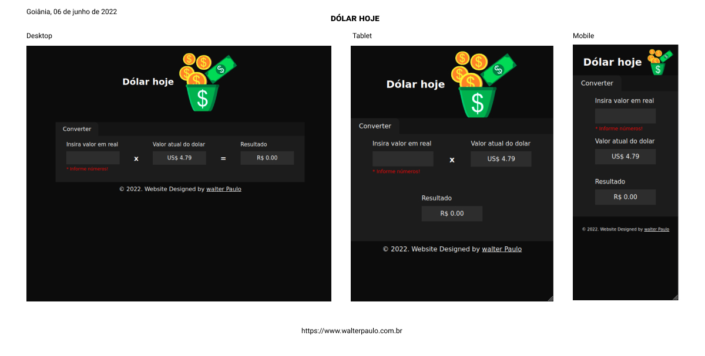
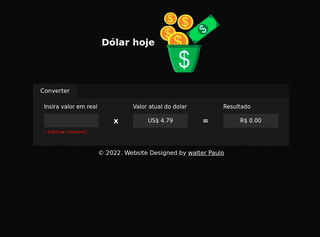

## Consulta valor do dólar

* Vite JS;
* JavaScript;
* React c/ TypeScript;
* Docker

### Init
criar image Docker
```
docker build -t walterpaulo/dolarhoje -f Dockerfile .
```

subir container Docker
```
docker run -d -p 4002:4173 --name dolarhoje walterpaulo/dolarhoje
```


   

### Resultados


 
